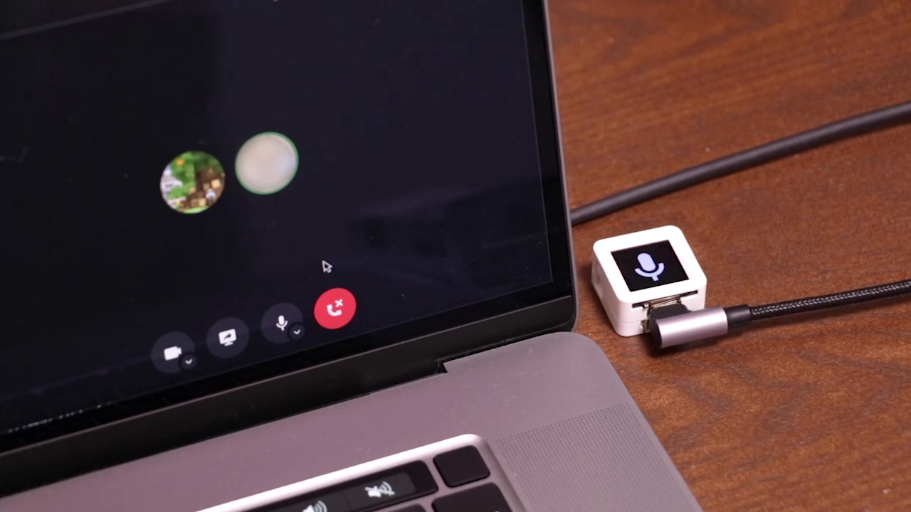

# ATOMS3 Mute Switcher

M5Stack ATOMS3を使った、Discordのミュートを切り替える装置です。



## 導入方法

[Discord Developer Portal](https://discord.com/developers/applications) から新しいアプリケーションを作成し、Client IDとClient Secretを取得します。

ATOM S3をPCに接続し、シリアルポート名を確認します。  
(Windowsであれば`COM`から、macOSであれば `/dev/tty`から始まります)

`Host` ディレクトリの中に `.env` という名前で下記ファイルを作成します。

```
DISCORD_CLIENT_ID=[ここにDiscordのClient IDを入力]
DISCORD_CLIENT_SECRET=[ここにDiscordのClient Secretを入力]
SERIAL_PORT=[ここにATOM S3のポート名を入力]
PORT=53134
```

PlatformIOにてUploadを行います。

Node.jsがインストールされていることを確認し、インストールされていない場合はインストールします。
ターミナルから下記コマンドを実行します。

```
cd Host
npm install
npm run serve
```
